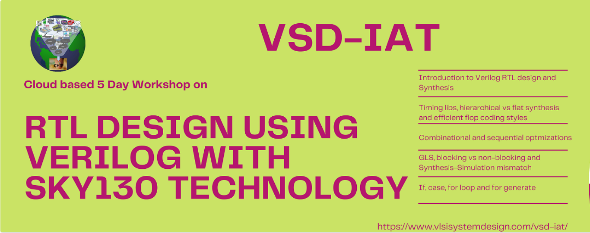
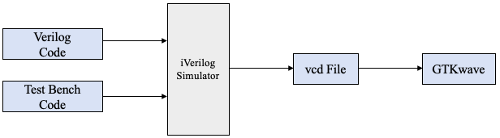

# RTL Design and Synthesis in Verilog using Sky130 Technology <!-- omit in toc -->



Table of Contents
- [Introduction](#-introduction)
- [1. Day 1 - Introduction to Verilog RTL design and Synthesis](#1-day-1---introduction-to-verilog-rtl-design-and-synthesis)
  - [1.1. Introduction to open source simulator iverilog](#11-introduction-to-open-source-simulator-iverilog)
    - [2.1.1. Simulation results](#211-simulation-results)
  - [1.2. Labs using iverilog and gtkwave](#12-labs-using-iverilog-and-gtkwave)
    - [2.2.1.1. Read RTL design](#2211-read-rtl-design)
  - [1.3. Introduction to Yosys and Logic Synthesis](#13-introduction-to-Yosys-and-Logic-Synthesis)
  - [1.4. Labs using Yosys and Sky130 PDKs](#14-labs-using-Yosys-and-Sky130-PDKs)
 - [2. Day 2 - Timing libs, hierarchical vs flat synthesis and efficient flop coding styles](#2-day-2---timing-libs-hierarchical-vs-flat-synthesis-and-efficient-flop-coding-styles)
  - [2.1. Introduction to Timing .libs](#21-introduction-to-timing-.libs)
  - [2.2. Hierarchial synthesis vs Flat synthesis](#22-hierarchial-synthesis-vs-flat-synthesis)
  - [2.3. Various Flop Coding Styles and optimization](#23-various-flop-coding-styles-and-optimization)
- [3. Day 3 - Combinational and Sequential Optimizations](#3-day-3---combinational-and-sequential-optimizations)
  - [3.1. Introduction to Optimizations](#31-introduction-to-optimizations)
  - [3.2. Combinational logic Optimizations](#32-combinational-logic-optimizations)
  - [3.3. Sequential logic Optimizations](#33-sequential-logic-optimizations)
- [4. Day 4 - GLS, blocking vs non-blocking and Synthesis-Simulation mismatch](#4-day-4---GLS,-blocking-vs-non-blocking-and-Synthesis-Simulation-mismatch)
  - [4.1. GLS, Synthesis-Simulation mismatch and Blocking/Non-blocking statements](#41-GLS,-Synthesis-Simulation-mismatch-and-Blocking/Non-blocking-statements)
  - [4.2. Labs on GLS and Synthesis-Simulation Mismatch](#42-Labs-on-GLS-and-Synthesis-Simulation-Mismatch)
  - [4.3. Labs on synth-sim mismatch for blocking statement](#43-Labs-on-synth-sim-mismatch-for-blocking-statement)
- [5. Day 5 - Optimization in synthesis](#1-day-1---optimization-in-synthesis)
  - [5.1. If Case constructs](#51-if-Case-constructs)
  - [5.2. Labs on "Incomplete If Case"](#52-labs-on-"incomplete-if-case")
  - [5.3. Labs on "Incomplete overlapping Case"](#53-labs-on-"incomplete-overlapping-case")
  - [5.4. for loop and for generate"](#54-for-loop-and-for-generate")
  - [5.5. Labs on "for loop" and "for generate"](#55-labs-on-"for-loop"-and-"for-generate")
# Introduction
The report is based on 5-day RTL Design and Synthesis in Verilog using the SKY130 Technolog workshop facilitated by VSD on using open source tools involving **iVerilog, GTKWave, Yosys** with **Sky130 technology**.  
This workshop introduces to the digital logic design using Verilog HDL. Validating the functionality of the design using Functional Simulation. Writing Test Benches to validate the functionality of the RTL design .Logic synthesis of the Functional RTL Code. Gate Level Simulation of the Synthesized Netlist.

**SKY130** is the hardware industry's first open-source process design kit (PDK) released by SkyWater Technology Foundry in collaboration with Google giving all hardware design experts and aficionados, a worldwide access to their IP functions and open source ASICs. 

# 1. Day 1 - Introduction to Verilog RTL design and Synthesis
## 1.1. Introduction to open source simulator iverilog
In the digital circuit design, **register-transfer level (RTL)** is a design abstraction which models a synchronous digital circuit in terms of the data flow between hardware register, and the logical operations performed on those signals. RTL abstraction is used in HDL to create high-level representations of a circuit, from which lower-level representations and ultimately actual wiring can be derived.  

**Simulator**: It is a tool which is used for checking the design. In this workshop we are using **iverilog** tool.**Simulation** is the process of creating models that mimic the behavior of the device you are designing (simulation models) and creating models to exercise the device (test benches).
**RTL Design**: It consists of an actual verilog code / a set of verilog codes that have the functionality to meet the required design specifications of the circuit.
**Test Bench**: It is the setup to apply stimulus(test vectors) to design to checks its functionality.

### HOW SIMULATOR WORKS 
Simulator looks for changes on input signals and based on that output is evaluated.

(Design may have 1 or more primary inputs and primary outputs but TB doesn't have.)
 ### SIMULATION FLOW

(Simulator continuously checks for changes in the input. If there is an input change, the output is evaluated; else the simulator will never evaluate the output.)

## 1.2. Labs using iverilog & gtkwave
 
 ### ENVIRONMENT SETUP

```
#Steps Followed:
//create a directory
$ mkdir VLSI 
//Git Clone vsdflow. 
$ git clone https://github.com/kunalg123/vsdflow.git
//Git Clone sky130RTLDesignAndSynthesisWorkshop. 
$ git clone https://github.com/kunalg123/sky130RTLDesignAndSynthesisWorkshop.git
```
.png) 
(sky130RTLDesignAndSynthesisWorkshop Directory has: My_Lib - which contains all the necessary library files; where lib has the standard cell libraries to be used in synthesis and verilog_model with all standard cell verilog models for the standard cells present in the lib. Ther verilog_files folder contains all the experiments for lab sessions including both verilog code and test bench codes.)
**Synthesis**: The RTL design description is translated into gate-level description by a synthesis tool. Very popular Open source synthesis tool [Yosys](http://bygone.clairexen.net/yosys/) is used for synthesis.  
The synthesis tool takes the RTL desgin and the cell library (liberty file) as inputs and translates the RTL into netlist.
Hence the netlist is the gate-level representation of the specifiec logic desgin via Verilog HDL in RTL.  


### 2.2.1. Yosys synthesizer flow

#### 2.2.1.1. Read RTL design
read_verilog: This command loads modules from a Verilog file to the current design[].  


#### 2.2.1.2. Generic synthesis
synth[options]: This command runs the default synthesis script. This command does not operate on partly selected designs[].  
&emsp;-top <module>: use the specified module as top module (default='top')  
  


#### 2.2.1.3. Read Sky130 cell library
read_liberty[options]: This command reads cells from liberty file as modules into current design[].  
&emsp;-lib: only create empty blackbox modules  


#### 2.2.1.4. Generate netlist
abc[options]: This pass uses the ABC tool [1] for technology mapping of yosys's internal gate library to a target architecture[].  
&emsp;-liberty <file>: generate netlists for the specified cell library (using the liberty file format).  
&emsp;In our case 'sky130_fd_sc_hd__tt_025C_1v80.lib'.  
*Note: When no target cell library is specified the Yosys standard cell library is loaded into ABC before the ABC script is executed.*  
  


#### 2.2.1.5. Show
Create a graphviz DOT file for the selected part of the design and compile it to a graphics file (usually SVG or PostScript)[].  


# 3. Day 2 - Timing libs, hierarchical vs flat synthesis and efficient flop coding styles
## 3.1. Timing libs
### 3.1.1. Sky130 Process Node
The SKY130 is a mature 180nm-130nm hybrid technology originally developed internally by Cypress Semiconductor before being spun out into SkyWater Technology and made accessible to general industry. SkyWater and Google’s collaboration is now making this technology accessible to everyone! [source: https://github.com/google/skywater-pdk]  
### 3.1.2. Introduction to standard cell library
On the gate-level the target architecture is usually described by a “Liberty file”. The Liberty file format is an industry standard format that can be used to describe the behaviour and other properties of standard library cells. [source from The Liberty Library Modeling Standard: http://www.opensourceliberty.org/.]  
As a part of SkyWater Open Source PDK, [multiple](https://skywater-pdk.readthedocs.io/en/main/contents/libraries/foundry-provided.html) standard digital cell libraries are provided that cover a range of different target architectures [source: https://github.com/google/skywater-pdk].  
In this workshop we will be using sky130_fd_sc_hd (high density) standard cell library (target architecture) to map our synthesized design from Yosys.  
Some trivial details of our Liberty file are shown below. Although a thorough look into it has to be given to understand its potenetial.  
  
Also let us have a look at some of the variants of 2-input AND cells from the Liberty library.  
Different variants of and2 with specific cell descriptions can be seen.  
  
[sky130_fd_sc_hd__and2](https://antmicro-skywater-pdk-docs.readthedocs.io/en/test-submodules-in-rtd/contents/libraries/sky130_fd_sc_hd/cells/and2/README.html)  


## 3.2. Hierarchial synthesis vs Flat synthesis
### 3.2.1. Hierarchial synthesis
In hierarchial synthesis the hierarchy of the RTL design is preserved through the final netlist. Let us look at the below RTL design where we have two sub modules, both instantiated by a top modules.  


Generic synthesis preserves the hierarchy. It can also be seen that the cells are not mapped to sky130 specific technology yet.  


abc tool maps the technology to Sky130 and generates the netlist. It can be seen that the hierarchy is still preserved.  


It is quite interesting to see how tool itself goes through optimization. RTL mutiple modules.v when synthesized with two different versions of yosys- 07 and 0.9 versions.  
The optimization at the technology mapping of sub_modules2.  
Also quite intesting how yosys decided on two different flavors of and2 for sub_module1 in these versions.    


Details of the realized standard sky130 cells in this design can be found from Skywater PDK documentation.  
[2-input AND](https://antmicro-skywater-pdk-docs.readthedocs.io/en/test-submodules-in-rtd/contents/libraries/sky130_fd_sc_hd/cells/and2/README.html)  
[Input isolation, noninverted sleep](https://antmicro-skywater-pdk-docs.readthedocs.io/en/test-submodules-in-rtd/contents/libraries/sky130_fd_sc_hd/cells/lpflow_inputiso1p/README.html)  

### 3.2.2. Selective sub-module level synthesis
Just like synthesizing an RTL design at the top mudule level, it can be synthesized at the sub-module level as well. This level of freedom brings the below advantsges.  
* &emsp;  Multiple instantions: In case of having multiple instantiations in our design, this feature helps to synthesize just one instance and use it iteratively throughout the top level.    
* &emsp;  Massive desgins: In case of massive design, sub-module level synthesis reduces the burden on sythesis tool in-terms of performance and time.  
 
We can take a look at the same example of multiple_modules.v.  Let us synthesize only sub_module1 and see how the final netlist appears.  
We can see that the synth command just looks at the specified sub_module1 alone and sub_module2 is ommitted from synthesis.  
  

The generated synthesis output this time gives only the AND gate for the sub_module1 rtl.  
  

The graphical view clearly indicates the netist for synthesized sub_module1.  
  


### 3.2.3. Flat synthesis
yosys command flatten :"This pass flattens the design by replacing cells by their implementation. This pass is very similar to the 'techmap' pass. The only difference is that this pass is using the current design as mapping library.  
Cells and/or modules with the 'keep_hierarchy' attribute set will not be flattened by this command." [source: http://yosyshq.net/yosys/cmd_flatten.html]  

As the name suggestes this pass flattens out the design and hence the hierarchy is lost.  
Let us observe the impact of 'flatten' on systhesized output of same RTL design- multiple_modules.v.  
  

We can see that the submodules were deleted and hierarchy is no longer preserved.  
Please pay attantion to the interesting netlist generated.  
  

Graphical view of flattened netlist is hown below.  
  

## 3.3. Various Flop coding styles and optimization
abc tool maps only the combinational logic cells from the liberty. It doesn't look for the register cells.  
If the RTL design has sequential logic, dfflibmap pass has to be executed before abc pass. dfflibmap pass looks for the register cells in the Liberty and maps to the sequential logic from the synthesis. And then abc pass has to used to complete the mepping for combinatorial logic.  
  
  
Without dfflibmap pass if abc pass is executed, and if the design has only registers, abc has nothing to map and warns like below.  
  
First the register cells must be mapped to the registers that are available on the target architectures. The 
target architecture might not provide all variations of d-type flip-flops with positive and negative clock
edge, high-active and low-active asynchronous set and/or reset, etc. Therefore the process of mapping the
registers might add additional inverters to the design and thus it is important to map the register cells
first. [source: [Yosys manual](https://raw.githubusercontent.com/wiki/jospicant/IceStudio/yosys_manual.pdf)]  

Let us try to understand this with an example RTL design- 'dff_asyncres.v'.  
Let us run synth -top on the design and take a look how it looks. We can see that it just represet a d-flip flop.  
  
Let us run dfflibmap -liberty pass on this design and see how it looks. dfflibmap mapped a variant of d-flip flop to our design and this led to an additional inverter in the design.  
  
Now abc -liberty pass has to be run to complete the mapping of combination logic (the inverter cell). This comepletes the mapping.  
  

### 3.3.1. Optimizations
By this time we have already noticed that our behavioural description (RTL design) goes through optimizations. As an example from our previously discussed design- multiple_modules.v, the sub_module2 which synthesized to be an OR gate but ended up being somethig diffrent. It has been mapped to a cell- 'sky130_fd_sc_hd__lpflow_inputiso1p_1' by Yosys from the Liberty. These optimizations are performed by the synthesis tool minimizing area, power consumption etc. in perspective.  
  
